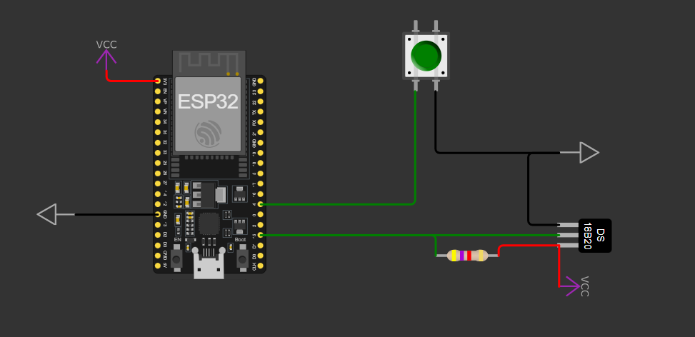

### /src
_____

#### main.cpp  
denne fil håndtere loading af div. moduler og kalde funktioner til at sende & gemme værdier.

#### APService.(h/cpp)
* .h: Indeholder funktionsforskrifter men uden funktionalitet.
* .cpp: Indeholder funktionalitet ift. at lave access point, tilslutte et wifi samt at resette indstillinger.

#### FileManager.(h/cpp)
* .h: Indeholder funktionsforskrifter men uden funktionalitet.
* .cpp: Indeholder diverse funktioner til at gemme, læse og konvertere data til/fra json/WeatherData.

#### Models/WeatherData.h
* .h: Indeholder data klassen, properties, constructors samt getters & setters.

#### SensorService.(h/cpp)
* .h: Indeholder funktionsforskrifter men uden funktionalitet.
* .cpp: Registrere temperaturmåleren og sætter den op.

#### NTPService.(h/cpp)
* .h: Indeholder funktionsforskrifter men uden funktionalitet.
* .cpp: Kalder ntp api'en for at finde ud af klokkeslæt.

#### Pages.(h/cpp)
* .h: Indeholder global/statisk variabel.
* .cpp: Sætter værdien i den globale variabel til at være en parsed html hjemmeside.

#### WebServerService.(h/cpp)
* .h: Indeholder funktionsforskrifter men uden funktionalitet.
* .cpp: Opstarter webserveren med div. endpoints til forskellige funktionaliteter og sider fra Pages, samt opstarter websocketen

#### WebSocketService.(h/cpp)
* .h: Indeholder funktionsforskrifter men uden funktionalitet.
* .cpp: Opstarter websocketen for at data kan modtages af en klient som der lytter med.

_____

### Opstart
For at dele kode og funktionalitet op, har jeg lavet forskellige setup funktioner til hver af de forskellige typer som kræver en form for initialisering.
Alle disse setup funktioner bliver kaldt i main.cpp->setup, hvor den så logger hvor langt den kommer.
Det er sat op i følgende rækkefølge: 
1. Start Access point service, for at oprette/tilslutte til nettet
2. Start SPIFFS for at hente tidligere gemte dater
3. Start NTP for at få fat i klokken
4. Start Sensor for at få fat i temperaturen
5. Læs tidligere json data gemt på arduinoen
6. Start Webserveren med hjemmesiden
7. Start websocketen for at kunne sende data til hjemmesiden

_____

### Ip'er
Hvis der ikke er tilsluttet et netværk, vil ip'en være 192.168.4.1 hvor internettet skal konfigureres ved at tislutte det oprettet access point og tilgå http://192.168.4.1/, men hvis den connecter til et wifi bliver ip'en 192.168.1.204 og data hjemmesiden kan så findes på http://192.168.1.204/
_____

### Frontend
Hjemmesiden er lavet med plain html, css og javascript alt i en side med <script> tag.
_____

### Loop
Loop funktionen i main.cpp starter med at tjekke om knappen er trykket nede, hvis den er det vil den lave et sleep på 10 sekunder og tjekke igen, hvis den stadig er det vil internet forbindelsen bliver resetted.
Efterfølgende henter den temperaturen, tiden hvor den også formatere den, gemmer disse værdier i en variabel og påbegynder at sende dataen via. websocketen. Den vil efterfølgende indsætte de værdier til datafilen.
_____

### Diagram
